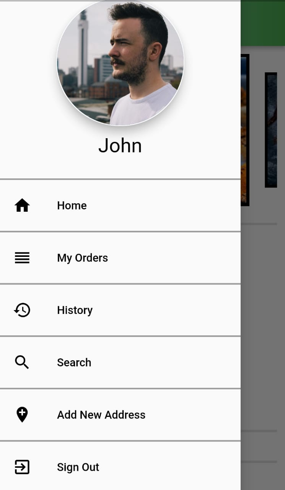

# Kitchen2Cabin
A solution developed in Flutter for small scale entrepreneurs wanting to compete with Multinational Foodchains in terms of accesibility and ease of business.It has 3 apps Seller App, User App,Rider App and a Web Admin Portal.

## Process Flow of the App
1)Restaurant/Tiffin Service owners can register their restaurants/tiffin services and add different menu categories and items for each category in the Seller's App.  
2)Customers can register in the User's app, with authentication and add food items to their cart and place orders.   
3)Riders can register and check for available orders that haven't been delivered yet in the Rider's App.  
4)The Admin can check the list of registered Sellers, Riders and Customers and also block/unblock user profiles via the Admin Web Portal.  

## Features of Seller's App
1) A clean UI with Sign-up, Login, options to add categories of the Menu and different items for each category.  
2) Tracking new orders and checking status of placed orders.  
3) Record of past orders displayed as Order History.  
4) Total Earnings displayed via the My Earnings tab.  

## Features of User's App
1) A clean UI with Sign-up, Login, options to add items in the cart and place order.
2) Searching restaurants for food items.
3) Record of past orders displayed as Order History.
4) Add new addresses as delivery locations.
5) Record of current undilivered orders in My Orders tab.    
## Features of Rider's App
1) Lightweight UI with Sign Up, Login and list of currently available orders.  
2) List of orders to be picked up in the Parcels in Progress tab.
3) List of orders to be delivered in the Not Yet Delivered tab.  
4) Record of previous deliveries in the History Tab.
5) Total earnings displayed in Earnings tab.

## Features of Admin Web Portal
1) A comprehensive and clean UI with lists of Registered Sellers, Riders and Customers on the different apps.
2) Details of all registered accounts.
3) Block/Unblock registered users from different apps.  
4) Setting the Earnings per Delivery for Riders.
## External Libraries Used
1) Image picker 0.6.7: for picking images and videos from gallery or camera.
2) Firebase Auth 0.18.1: for user login/ signup authentication.
3) Firebase core 0.5.0 and Cloud Firestore 0.14.1: for using Google Cloud Firestore database  
4) Permission Handler 3.0.0: for easy permission handling
5) Date Format 1.0.9: for easy date formatting
6) Path Provider 1.6.18: for getting path for storing temporary files
7) Firebase Storage 4.0.1: for using Firebase Cloud Storage
8) fluttertoast 7.1.1: to display toast messages
9) Shared Preferences 0.5.12: to enable Shared Preferences support
10) URL Launcher 5.7.6: for URL launching
## Screenshots
Here are a few Screenshots for more intricate details of the apps and Web Admin Portal
Seller's App

<table>
  <tr>
    <td></td>
    <td></td>
    <td></td>
  </tr>
 </table>
 <table>
  <tr>
    <td></td>
    <td></td>
    <td></td>
  </tr>
 </table>

User's App

 <table>
  <tr>
    <td></td>
    <td></td>
    <td></td>
  </tr>
 </table>
  <table>
  <tr>
    <td></td>
    <td></td>
    <td></td>
  </tr>
 </table>
  <table>
  <tr>
    <td></td>
    <td></td>
    <td></td>
  </tr>
 </table>
  <table>
  <tr>
    <td></td>
    <td></td>
  </tr>
 </table>

Rider's App

<table>
  <tr>
    <td></td>
    <td></td>
    <td></td>
  </tr>
 </table>
  <table>
  <tr>
    <td></td>
    <td></td>
    <td></td>
  </tr>
 </table>
  <table>
  <tr>
    <td></td>
    <td></td>
    <td></td>
  </tr>
 </table>
  <table>
  <tr>
    <td></td>
    <td></td>
  </tr>
 </table>

<!-- /

 -->

<!-- User's App

ent.com/86646962/180577376-3fa26f58-b408-458b-8437-3386ec618538.jpeg)
 -->
## To try your hands on the Project
1) Clone the repository.  
2) Create a Firebase project, add com.example.kitchen2cabin, com.example.kitchen2cabin_sellers_app, com.example.kitchen2cabin_users_app, com.example.kitchen2cabin_riders_app to it, edit rules as required.
3) For each app, place google-services.json in /android/app/ folder.
4) Build the app, deploy to your device and you are good to go.

## Team Details
1. <a href="https://github.com/ishankhan7572">Ishan Khan</a>
2. <a href="https://github.com/ishanchal">Ishanchal Kashyap</a>
<!-- 1) Ishan Khan
2) Ishanchal Kashyap -->
